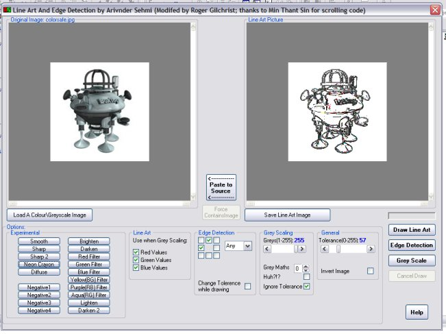



## Lineart and Scrolling Picturebox \(Class remix\)

### Description

This is my remix of Arvinder Sehmi's Line Art and Min Thant Sin's Screen Scrolling code. I have converted their code to more easily reuseable classes. I have also optimized and enhanced (I hope)their code for speed and easy of use.

The Line Art code has added effects and settings (some are only partial developed), is optimized for greater speed and I hope readability of the code. Thanks to 'Graphical Routine Maths' by Steven Paterson for maths to do some of the better ones.

The Screen Scrolling code now has a way to centre smaller images and disable unneeded scrolling. The Class takes care of sizing all the necessary controls within a Frame. Also allows you to interlock two Scrolling PictureBoxes to each other with a single call. This class is an extensive demo of using WithEvents in classes.

I think I 've imporved the earlier code enough to accept votes otherwise send them to the originals. 'Line Art Creation, And Edge Dection' by Arvinder Sehmi. 'Scroll Mouse Keys Move Pix' by Min Thant Sin

COMMENTS, ENHANCEMENTS, QUESTIONS very welcome. Do you have/know similar routines that could also be included?
 
### More Info
 

             |
---                |---
**Submitted On**   |2002-12-31 09:34:58
**By**             |[Roger Gilchrist](https://github.com/Planet-Source-Code/PSCIndex/blob/master/ByAuthor/roger-gilchrist.md)
**Level**          |Intermediate
**User Rating**    |5.0 (25 globes from 5 users)
**Compatibility**  |VB 6\.0
**Category**       |[Graphics](https://github.com/Planet-Source-Code/PSCIndex/blob/master/ByCategory/graphics__1-46.md)
**World**          |[Visual Basic](https://github.com/Planet-Source-Code/PSCIndex/blob/master/ByWorld/visual-basic.md)
**Archive File**   |[Lineart\_an152284122003\.zip](https://github.com/Planet-Source-Code/roger-gilchrist-lineart-and-scrolling-picturebox-class-remix__1-42118/archive/master.zip)

